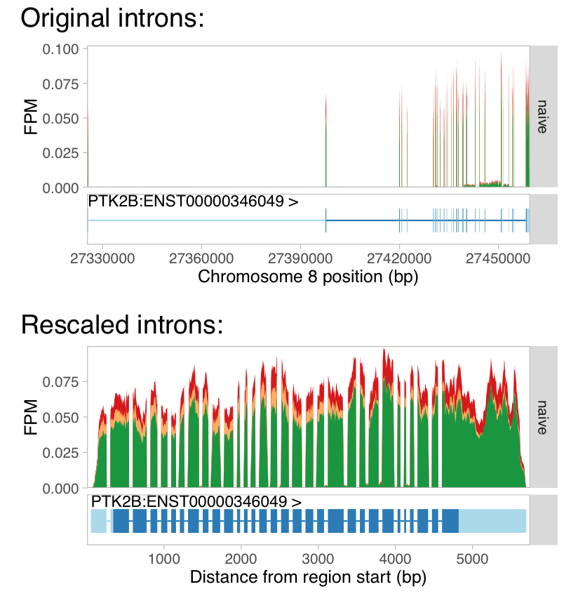

# _wiggleplotr_
_wiggleplotr_ is a tool to visualise RNA-seq read overage overlapping gene annotations. A key feature of _wiggleplotr_ is that it is able rescale all introns of a gene to fixed length, making it easier to see differences in read coverage between neighbouring exons that can otherwise be too far away. Since _wiggleplotr_ takes standard BigWig files as input, it can also be used to visualise read overage from other sequencing-based assays such as ATAC-seq and ChIP-seq. 



## Installation
This repostitory contains the development version of _wiggleplotr_. The latest stable version can be installed directly from [Bioconductor](https://bioconductor.org/packages/wiggleplotr/):
```r
## try http:// if https:// URLs are not supported
if (!requireNamespace("BiocManager", quietly=TRUE))
    install.packages("BiocManager")
BiocManager::install("wiggleplotr")
```
## Since I modified part of the function so you can also download from my github
```
library("devtools")
devtools::install_github("guokai8/wiggleplotr")
```
However, the stable Bioconductor version is likely to be the best option for most people.

## Getting started
See the [vignette](https://htmlpreview.github.io/?https://github.com/kauralasoo/wiggleplotr/blob/master/vignettes/wiggleplotr.html) for instructions on how to get started.

## Citation
If you use this software for research, please cite the following paper in which it was first described: [Transcriptional profiling of macrophages derived from monocytes and iPS cells identifies a conserved response to LPS and novel alternative transcription (Alasoo et al, 2015)](http://www.nature.com/articles/srep12524)
