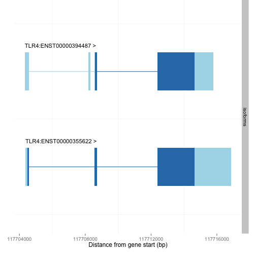
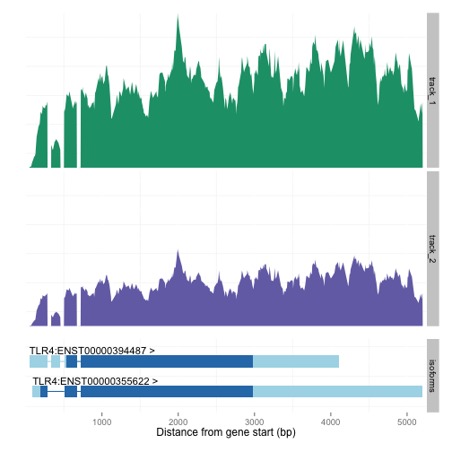
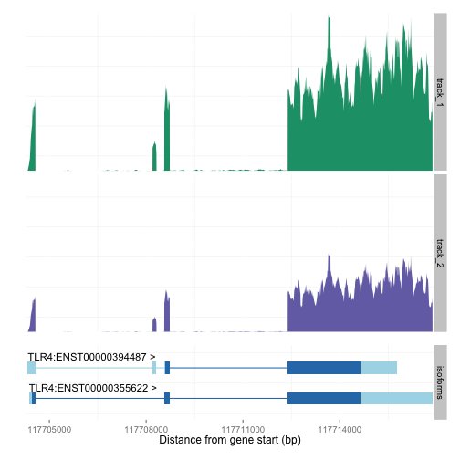
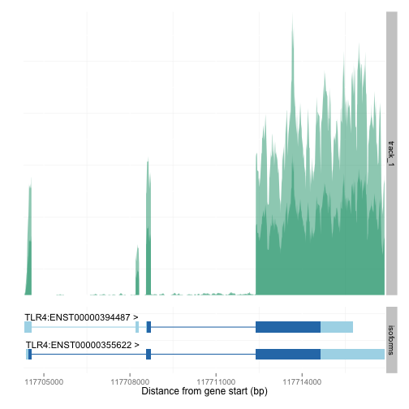

# wiggleplotr
Wiggleplotr is an R package to plot alternative transcript structures of a gene and RNA-Seq read coverage across them. A key feature of wiggleplotr is that it allows to scale introns to a fixed length. This feature greatly improves visualisation of alternative transcription events such as alternative promoter usage, alternative splicing and alternative 3’ end usage, because alternative exons are shown immediately adjacent to each other.

## Installation
Wiggleplotr R package can we installed from GitHub. It requires the following R packages to be installed: girdExtra, ggplot2.

## Usage
Wiggleplotr has two main functions: **plotTranscripts** that can be used to plot alternative transcripts of a gene, and **wiggleplotr** to plot RNA-Seq read coverage together with alternative transcripts.

### Plotting alternative transcripts
The **plotTranscripts** function has four parameters:
* `gene_exons` - list of GRanges objects, each object containing exons for one transcript. The list must have names that correspond to transcript IDs.
* `gene_cdss` (optional) - list of GRanges objects, each object containing the coding regions (CDS) of a single transcript. The list must have names that correspond to transcript IDs. If specified then coding and non-coding regions will be plotted in a different colour.
* `plotting_annotations` - data frame with the following four columns: `transcript_id`, `gene_id`, `gene_name`, and `strand`. All of the transcripts in the gene_exons and gene_cdss lists must have a matching transcript ID in the transcript_id column. This data frame is used to add gene name and strand to the transcript structure plot.
* `rescale_introns` - Specifies if the introns should be scaled to fixed length or not. (default: TRUE)
* `new_intron_length` - length (bp) of introns after scaling. (default: 50)

The `gene_exons` and `gene_cdss` lists as well as `plotting_annotations` data frame can all be constructed manually. However, an easier option is to download all of the necessary data from Ensembl biomart. Detailed instructions together with code are given here. 

#### Example: plot protein coding transcripts of the TLR4 gene
First, you need to download Ensembl transcript annotations and metadata by following this [tutorial](https://github.com/kauralasoo/wiggleplotr/blob/master/download_annotations.md). Once the annotations have been downloaded, we can load them into R.


```r
library("devtools")
library("GenomicFeatures")
library("dplyr")
load_all("../wiggleplotr/")
```

```r
transcript_metadata = readRDS("transcript_metadata.rds")
txdb79 = loadDb("data/TranscriptDb_GRCh38_79.db")
```
Next, we extract exon and coding sequence (CDS) coordinates from the transcript database

```r
exons = exonsBy(txdb79, by = "tx", use.names = TRUE)
cdss = cdsBy(txdb79, by = "tx", use.names = TRUE)
```
We can also find all protein coding transcript of the TLR4 gene

```r
tlr4_tx = dplyr::filter(transcript_metadata, gene_name == "TLR4", transcript_biotype == "protein_coding")
tlr4_tx
```

```
##     transcript_id         gene_id gene_name strand   gene_biotype
## 1 ENST00000394487 ENSG00000136869      TLR4      1 protein_coding
## 2 ENST00000355622 ENSG00000136869      TLR4      1 protein_coding
##   transcript_biotype
## 1     protein_coding
## 2     protein_coding
```
Finally, we plot the exon structure of these two transcripts:

```r
tlr4_txids = tlr4_tx$transcript_id
plotTranscripts(exons[tlr4_txids], cdss[tlr4_txids], transcript_metadata, rescale_introns = FALSE)
```

 

### Plotting RNA-Seq read coverage
The **wiggleplotr** command works similarly to plotTranscripts, but it requires an additional data frame that describes where the bigWig files containing the read coverage are located and how to the data should be plotted. If you do not have bigWig files yet, then you can learn how to create them here.

The **wiggleplotr** function has the following parameters:
* `exons` - list of GRanges objects, each object containing exons for one transcript. The list must have names that correspond to transcript IDs.
* `cdss` (optional) - list of GRanges objects, each object containing the coding regions (CDS) of a single transcript. The list must have names that correspond to transcript IDs. If specified then coding and non-coding regions will be plotted in a different colour.
* `track_data` - data frame with the metadata for the bigWig read coverage files. Must contain the following columns: 
  * `sample_id` - unique id for each sample.
  * `track_id` - if multiple samples (bigWig files) have the same `track_id` they will be overlayed on the same plot, `track_id` is also used as the facet label on the right.
  * `bigWig` - path to the bigWig file.
  * `scaling_factor` - normalisation factor for each sample, useful if different samples sequenced to different depth and bigWig files not normalised for that.
  * `colour_group` - additional column to group samples into, is used as the colour of the coverage track
* `transcript_annotations` - data frame with the following four columns: `transcript_id`, `gene_id`, `gene_name`, and `strand`. All of the transcripts in the exons and cdss lists must have a matching transcript ID in the transcript_id column. This data frame is used to add gene name and strand to the transcript structure plot.
* `rescale_introns` - Specifies if the introns should be scaled to fixed length or not. (default: TRUE)
* `new_intron_length` - length (bp) of introns after scaling. (default: 50)
* `flanking_length` - Lengths of the flanking regions upstream and downstream of the gene. (default: c(50,50))
* `plot_fraction` - Size of the random sub-sample of points used to plot coverage (between 0 and 1). Smaller values make plotting significantly faster. (default: 0.1)
* `heights` - Specifies the proportion of the height that is dedicated to coverage plots (first value) relative to transcript annotations (second value). (default: c(0.75,0.25))
* `alpha` - Transparency (alpha) value for the read coverage tracks. Useful to set to something < 1 when overlaying multiple tracks (see `track_id`). (default: 1)
* `fill_palette` - Colour palette used for the coverage tracks.


#### Examples
First, we need to set up the the `track_data` data frame:

```r
track_data = data_frame(sample_id = c("sample_1", "sample_2"), track_id = c("track_1", "track_2"), bigWig = c("data/sample1.str2.bw", "data/sample1.str2.bw"), scaling_factor = c(1,2), colour_group = c("control", "treatment"))
track_data
```

```
## Source: local data frame [2 x 5]
## 
##   sample_id track_id               bigWig scaling_factor colour_group
## 1  sample_1  track_1 data/sample1.str2.bw              1      control
## 2  sample_2  track_2 data/sample1.str2.bw              2    treatment
```

Now we can make the coverage plot in which the introns have been rescaled:

```r
tlr4_plot = wiggleplotr(exon = exons[tlr4_txids], cdss = cdss[tlr4_txids], track_data = track_data, transcript_annotations = tlr4_tx, rescale_introns = TRUE)
plot(tlr4_plot)
```

 

We can also make the coverage plot in which the introns are displayed in full length:

```r
tlr4_plot = wiggleplotr(exon = exons[tlr4_txids], cdss = cdss[tlr4_txids], track_data = track_data, transcript_annotations = tlr4_tx, rescale_introns = FALSE)
plot(tlr4_plot)
```

 

Finally, we can overlay multiple samples by setting up a modified `track_data` data frame that has more than one sample per track:

```r
track_data_overlay = data_frame(sample_id = c("sample_1", "sample_2"), track_id = c("track_1", "track_1"), bigWig = c("data/sample1.str2.bw", "data/sample1.str2.bw"), scaling_factor = c(1,2), colour_group = c("control", "control"))
track_data
```

```
## Source: local data frame [2 x 5]
## 
##   sample_id track_id               bigWig scaling_factor colour_group
## 1  sample_1  track_1 data/sample1.str2.bw              1      control
## 2  sample_2  track_2 data/sample1.str2.bw              2    treatment
```
Now, we need to set alpha to something less than 1:

```r
tlr4_plot_overlay = wiggleplotr(exon = exons[tlr4_txids], cdss = cdss[tlr4_txids], track_data = track_data_overlay, transcript_annotations = tlr4_tx, rescale_introns = FALSE, alpha = 0.5)
plot(tlr4_plot_overlay)
```

 
